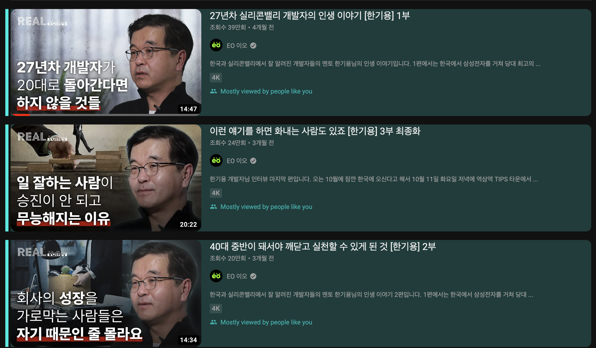
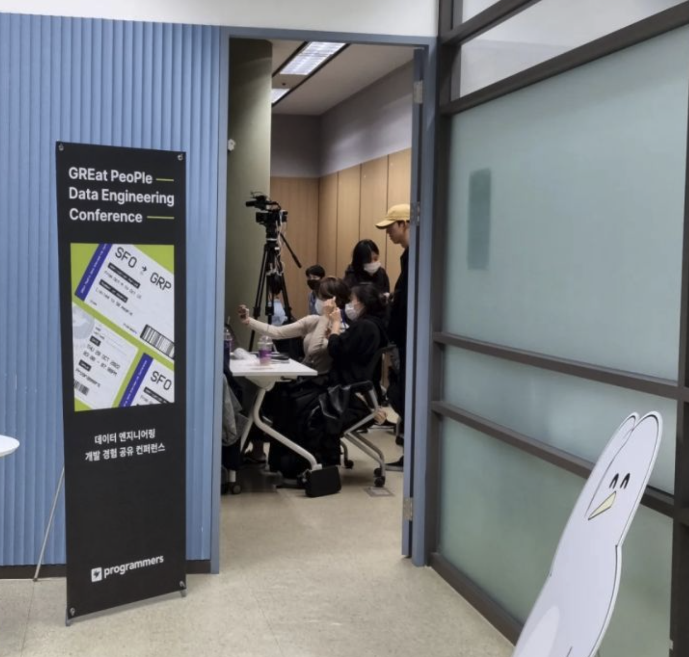
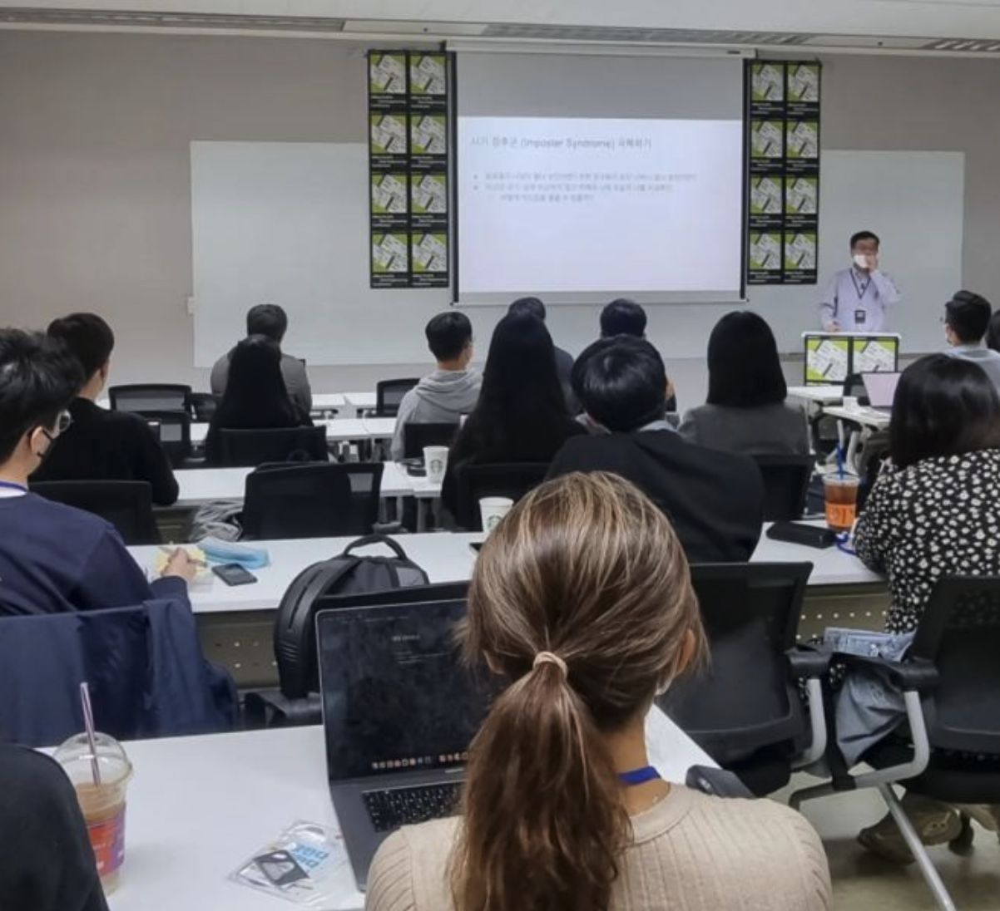

# 실리콘밸리에서 날아온 데이터 엔지니어링 컨퍼런스

### 배경

제가 처음 [실리콘밸리에서 날아온 데이터 엔지니어링 코스](https://school.programmers.co.kr/learn/courses/14982)를 알게 된 건 아래 Youtube EO Channel에 올라온 한기용님 영상을 시청한 이후 입니다. 총 3부까지 있는 이 영상을 보고 나서 여러가지로 많은 생각을 하게 되었습니다. 혹시 아직 안보셨다면 한번쯤 가볍게 시청해보시는 것도 추천 드립니다.

기존에 4년정도 데이터 엔지니어링 업무를 대기업에서 했었는데, 다른 곳에서는 어떻게 하고 있는지 궁금하기도 하고 내가 기존에 몰랐던 것들을 혹시 배울 수 있지 않을까 하여 코스를 신청하게 되었습니다. 다 듣고 보니 세상은 역시 넓고 배울것은 많았습니다 ㅎㅎ.. 나름 알차게 코스가 구성되어 있어 많은 걸 배울 수 있었던 것 같습니다.

이 코스는 2022년 10월 기준 벌써 10기를 운영할 만큼 관련 종사자분들이 많이 듣고 계시기도 한데 이번에 코스 수강생들 대상으로 기용님이 데이터 엔지니어링 [컨퍼런스를](https://school.programmers.co.kr/learn/courses/15230) 열어주셔서 다녀온 후기를 작성해보려 합니다.

(출처 : https://www.linkedin.com/in/hannahhejang/)

### 목차

금일 컨퍼런스 목차입니다.

1. Airflow 환경 고도화하기 ([hoyeon lee](https://www.linkedin.com/in/ACoAAB0dV2QBZEoHPDMHVUaWR3F-okOKbAsuqhQ))
2. 공공데이터 적재하기 ([Eunji Yi](https://www.linkedin.com/in/ACoAADdQHFoBvXqcwhKQG5YBRI0MNzRqGv_9j7w))
3. 스타트업에서 데이터기반 의사결정 구조 만들기 ([Minjong Kim](https://www.linkedin.com/in/ACoAAAJgCuMBC6ob4tTNYE290unr86fVRLD7blM))
4. 참석자 네트워킹

비록 시간대가 퇴근 후 저녁시간대였지만 1번부터 3번까지 흥미로운 주제로 가득했고 이는 컨퍼런스에 참가할 충분한 동기부여가 되었습니다. 참석자간 네트워킹 시간 같은 경우, 제가 한번도 경험이 없기 때문에 사실 한국 특성상 서먹서먹하고 어색한 분위기가 흐르다가 끝나지 않을까 막연한 예상을 하고 일단 들어갔습니다.

(출처 : https://www.linkedin.com/in/hannahhejang/)

### Airflow 환경 고도화하기

금일 컨퍼런스 첫번째 세션입니다. 쏘카의 Grab님이 발표를 진행해 주셨습니다.

GKE에서 K8S에 Airflow를 운영중이셨고, 통합 저장소로 BigQuery를 사용중이셨습니다. Airflow는 외부 저장소에서 BigQuery로 데이터를 적재할때 Batch 작업을 하기 위해 주로 사용했네요.

Airflow 개발환경에 대한 이야기를 많이 말씀 해주셨습니다. 초기 아키텍처는 Git과 연계하여 DAG 버전관리와 동시에 Airflow에 배포되는 구조를 가져간 것 같구요. 운영환경 및 다른 동료들과 독립적인 환경을 구축하기 위해 Git Branch를 따로 가져가고 push되면 buddyworks, argocd를 통해 전용 airflow가 생성되어 테스트 및 검증 후 운영 merge되는 구조였다고 합니다.

이런 구조에서 발생했던 자원 낭비, 불편한 환경, 긴 피드백 루프등의 많은 이슈로 인해 개발 환경 파이프라인을 docker compose 기반 로컬 노트북 환경으로 개선을 했다고 합니다. GCP Service Account를 통합 인증 수단으로 활용하였고, DAG Parsing Optimization을 위해 .airflowignore를 적극적으로 활용하셨다고 해요.

이러한 개선 구조를 통해 클러스터를 띄우는 시간을 많이 단축시키고 피드백 루프를 단축시켜 생산성을 많이 향상시킬 수 있었다고 합니다.

이어서 테스트 환경에 대한 이야기가 나왔는데, DAG 기본 문법 등을 체크하기 위해 pytest를 활용하셨고, pre commit hook을 사용하셨다고 합니다. Github Action에서 컨벤션, 테스트, 검증 등을 추가로 진행했다고 하네요.

꿀팁들도 여러가지 소개해 주셨는데, 그 중에 CleanUp DAG를 만들어서 주기적으로 TI나 DagRun등의 정보를 삭제하여 전반적인 cluster 반응성 등을 향상시킨 점이 인상깊었습니다.

모니터링, DAG 운영 알람, 보안 및 RBAC 적용, 외부 접속 정보에 대한 secret 저장소 활용, gcp secret manager 적용 등 많은 내용을 얘기해 주셨지만 시간이 많지는 않은 관계로 깊이는 다루지 못했던것 같습니다.

이후 위 내용들을 포함한 전반적인 내용을 [SOCAR Tech Blog](https://tech.socarcorp.kr/data/2022/11/09/advanced-airflow-for-databiz.html)에서 소개해 주셔서 관심있으시면 한번 보시는걸 추천 드립니다.

### 공공데이터 적재하기

- 리트라이
- class 대통합
- 기관 커뮤니케이션
- 질문
- 공공데이터 관련해서 사용하기 쉽게 추상화를 잘 하셨는데 오픈소스 공개 의향 없으신지

### 스타트업에서 데이터기반 의사결정 구조 만들기

- 데이터 분산, 일원화 안되는 중
- nas 파일 기반 관리
- google spreadsheet
- ml 모델평가 추론 환경 개선
- s3 sagemaker batch transform + db저장
- 추론코드를 반복적으로 돌리지 않게 개선
- 변경 히스토리
- 통일되지 않은 데이터 타입, 변수명..
- 데이터 가시성 확보
- 개선 가능하지만 인지하지 못했던 문제들..
-
- 질문
- prefect는 왜 취소선?
- gs에서 마이그레이션은 어떻게

### 네트워킹

네트워킹 같은 경우 사람이 50명 가량 되어 여러 팀으로 나누어 진행하였습니다. 팀마다 발표하신 연사분들이 10분씩 돌아가며 질답을 받아주시고, 중간중간 자유롭게 주변 사람들하고 네트워킹 하는 시간을 가졌는데, 서먹할 것이라는 예상과 다르게 다들 엄청 적극적으로 네트워킹을 하셨던 것 같습니다. (순간 여기가 한국이 맞나 생각이 들었습니다 ^^;) 덕분에 소심한 저도 조금씩 질문도 하고 명함도 주고받고 했던 것 같네요.

여러 스타트업, 중견기업, 대기업에 다니시는분들이 골고루 계셨던 것 같고 취업준비생 분들도 간혹 계셨던 것 같습니다. 평소에 자주 쓰던 앱을 개발한 회사에서 오신분들을 보니 신기하기도 하고 짧지만 궁금했던 것들을 물어보며 그들의 생각도 조금이나마 들어볼 수 있던 좋은 시간이었습니다.

네트워킹을 1시간이나 잡아서 너무 많은 시간을 잡은 것 아닌가라는 생각을 했었는데, 마지막에는 다들 시간이 모자라서 허겁지겁 명함만 교환하고 아쉽게 헤어졌던 것 같네요.

